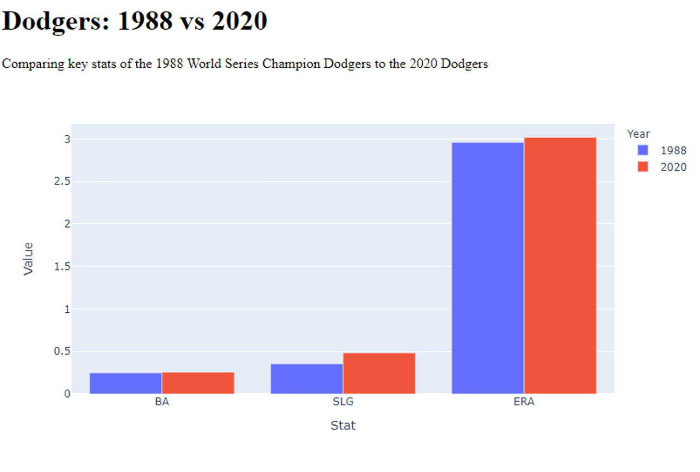

# dash-Dodgers1
A simple web app comparing the 1988 Dodgers to the 2020 Dodgers

This is the simplest possible web app using the Dash/Plotly framework. 

To run the application, navigate to the directory containing the app.py file in a command prompt
and start the app up using 'python app.py'. A Dash server will run locally and will default to 
the address 

Run this app with `python app.py` and

visit http://127.0.0.1:8050/ in your web browser.
Close app with 'ctrl + c'

Image above !